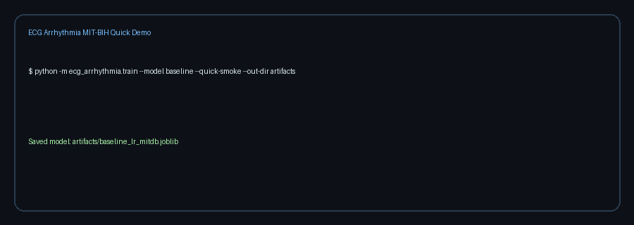

# ecg-arrhythmia-mitbih

[](https://github.com/tenzindhonyoe/ecg-arrhythmia-mitbih-pvc-pac-classifier/actions/workflows/ci.yml)
[](LICENSE)
[](pyproject.toml)
[](#medical-safety-disclaimer)

A small, well-tested, **honestly characterised** open-source ECG beat classifier
for three classes — `N` (Normal), `V` (PVC, Premature Ventricular Contraction),
and `a` (PAC, Premature Atrial Contraction; MIT-BIH `A` and `a` merged) —
trained on the MIT-BIH Arrhythmia Database.

Two models ship in this repo:

| Model         | Features              | Train deps  | Use when                                    |
| ------------- | --------------------- | ----------- | ------------------------------------------- |
| **LR**        | 180-sample beat + 2 RR | scikit-learn | You want a 5 KB model that infers in ~0.04 ms |
| **ResNet-1D** | Same window + RR head | + PyTorch    | You want better minority-class recall and can spend ~3 ms/beat |

Both share the same preprocessing, splits, and CSV inference path, so swapping
between them is a `--model` flag.

## Medical safety disclaimer

This repository is for research and education only. **It is not a medical
device.** Do not use it for diagnosis, treatment, triage, or clinical
decision-making. The model is trained on a single MIT-BIH lead (MLII) and
behaves predictably worse on consumer wearables, ambulatory monitors, or
12-lead clinical ECGs.

## What this is — and isn't

- **Is**: a 3-class beat-by-beat classifier (N / PVC / PAC) trained on
  MIT-BIH MLII at 360 Hz, with patient-safe record-level train/val/test
  splits and a deliberately small feature set you can audit.
- **Is also**: an inference path for any 1-lead wearable signal (Apple Watch,
  KardiaMobile, Withings) — with explicit auto-resampling, polarity flip,
  and a domain-shift warning when the lead isn't MLII/II.
- **Isn't**: a multi-rhythm AAMI EC57 classifier (no S/F/Q classes), a
  12-lead model, or anything you should run on a patient.

## Performance — LR baseline on MIT-BIH

Trained on real MIT-BIH (48 records, single MLII channel, 360 Hz, seed 42).
Record-level split: 32 train / 6 val / 8 test records (no patient leakage).

**Test set (8 records, 16 367 beats)**

| Metric                    | Value |
| ------------------------- | ----- |
| Balanced accuracy         | **0.673** ([0.640, 0.703] 95% bootstrap CI) |
| Macro F1                  | **0.440** ([0.432, 0.448]) |
| ROC-AUC (one-vs-rest, macro) | **0.820** |
| Inference latency (CPU)   | 0.036 ms median, 0.040 ms p95 |
| Model size                | 5.2 KB (joblib) |

**Per-class test performance**

| Class | Support | Precision | Recall | F1   |
| ----- | ------- | --------- | ------ | ---- |
| N     | 15 152  | 0.981     | 0.599  | 0.744 |
| V (PVC) | 1 104   | 0.406     | 0.861  | 0.552 |
| a (PAC) | 111     | 0.013     | 0.559  | 0.025 |

The PAC row is the honest part of this table: only 111 PAC beats survive
into the test split, the morphology overlaps strongly with `N`, and the
class-weighted LR happily trades N-precision for PAC-recall. **Don't use
this baseline as an isolation gate for atrial ectopy.** The ResNet-1D
model (when trained — see `artifacts/resnet/metrics_resnet.json`) shifts
this balance noticeably.

Detailed numbers, per-class confusion matrix, and bootstrap CIs:
- `artifacts/baseline/metrics_baseline.json`
- `artifacts/baseline/confusion_matrix_test.png`
- `artifacts/baseline/benchmarks.json`

See `docs/MODEL_CARD.md` and `artifacts/comparison.md` for ResNet vs LR.

## Installation

```bash
python -m venv .venv
source .venv/bin/activate
pip install -e ".[dev]"           # LR baseline + tests + linter
pip install -e ".[dev,deep]"      # also pulls PyTorch for ResNet-1D
pip install -e ".[dev,deep,bench]" # also pulls matplotlib for confusion-matrix PNGs
```

## Quick start (no dataset required)

```bash
python -m ecg_arrhythmia.train --model baseline --quick-smoke --out-dir artifacts/smoke
python -m ecg_arrhythmia.infer --csv examples/sample_ecg.csv --input-fs 360 \
  --model-path artifacts/smoke/baseline_lr_mitdb.joblib \
  --scaler-path artifacts/smoke/baseline_lr_scaler.joblib
```

> The smoke artifacts live under `artifacts/smoke/` so they cannot be
> confused with real metrics. `metrics_smoke.json` carries an explicit
> "this is synthetic" warning.

## Train on MIT-BIH (real data)

```bash
python scripts/fetch_mitbih.py            # ~100 MB, ~5–15 min
python -m ecg_arrhythmia.train --model baseline \
  --data-dir data/mitdb --out-dir artifacts/baseline --seed 42

# Or, with the ResNet-1D model (requires PyTorch via [deep] extra)
python -m ecg_arrhythmia.train --model resnet \
  --data-dir data/mitdb --out-dir artifacts/resnet --seed 42 --epochs 30
```

Multi-lead training (concatenates morphology windows across leads):

```bash
python -m ecg_arrhythmia.train --model baseline \
  --data-dir data/mitdb --out-dir artifacts/baseline_2lead \
  --leads MLII V5
```

## Inference on your own ECG CSV

Input format: a CSV with a `signal` column (case-insensitive) or signal values
in the first column. Sampling rate is supplied via `--input-fs`.

```bash
# LR baseline, MIT-BIH-rate (360 Hz) input
python -m ecg_arrhythmia.infer --csv path/to/your_ecg.csv --input-fs 360 \
  --model-path artifacts/baseline/baseline_lr_mitdb.joblib \
  --scaler-path artifacts/baseline/baseline_lr_scaler.joblib

# ResNet, with explicit weights + config
python -m ecg_arrhythmia.infer --model resnet --csv path/to/your_ecg.csv \
  --input-fs 360 \
  --weights-path artifacts/resnet/resnet1d.pt \
  --config-path artifacts/resnet/model_config.json
```

## Wearable inference (Apple Watch / KardiaMobile / Withings, single Lead-I)

The model was trained on MIT-BIH MLII. Consumer single-lead wearables produce
Lead-I-style morphology at 250 Hz, and sometimes inverted polarity. The
inference path handles the resampling and polarity flip automatically and
emits a domain-shift warning so you do not silently quote MLII numbers on a
Lead-I trace.

```bash
# Generate a synthetic Lead-I CSV from a MIT-BIH record:
python scripts/make_wearable_demo.py --data-dir data/mitdb --record 100

# Run inference (auto-polarity is on by default):
python -m ecg_arrhythmia.infer \
  --csv examples/wearable_lead_i_synthetic.csv \
  --input-fs 250 --lead I \
  --model-path artifacts/baseline/baseline_lr_mitdb.joblib \
  --scaler-path artifacts/baseline/baseline_lr_scaler.joblib
```

Caveats — see `docs/MODEL_CARD.md` for the full list:
- Lead-I QRS amplitude is smaller and the R-peak orientation can flip.
  Auto-polarity catches the gross case; subtle cases still suffer.
- The model has never seen Lead-I morphology in training. **Expect a
  noticeable drop in PVC and PAC recall** vs the MIT-BIH numbers above.
- Motion artefact, electrode drift, and 50/60 Hz mains hum on consumer
  devices are not modelled.

## CLI entry points

```bash
ecg-train --help
ecg-infer --help
```

## Verification checklist

```bash
make lint && make test && make smoke
```

## Repository layout

```
src/ecg_arrhythmia/         # package
  ├─ labels.py              # MIT-BIH symbol → class id
  ├─ preprocessing.py       # WFDB load, segment, RR features, splits
  ├─ training.py            # train_baseline_lr, train_resnet_1d, _full_report
  ├─ inference.py           # CSV → R-peak detection → features → predictions
  ├─ train.py / infer.py    # argparse CLIs
  └─ models/resnet1d.py     # ResNet-1D + RR head (gated on [deep])

scripts/
  ├─ fetch_mitbih.py        # one-shot dataset download
  └─ make_wearable_demo.py  # generate examples/wearable_lead_i_synthetic.csv

artifacts/
  ├─ baseline/              # real LR baseline artifacts + metrics
  ├─ resnet/                # ResNet-1D weights + metrics (after training)
  └─ smoke/                 # synthetic-data CI smoke artifacts
```

## Documentation

- [`docs/DATA.md`](docs/DATA.md) — dataset composition, class distribution, license
- [`docs/MODEL_CARD.md`](docs/MODEL_CARD.md) — intended use, performance, limitations
- [`docs/REPRODUCIBILITY.md`](docs/REPRODUCIBILITY.md) — seeds, expected runtime,
  expected metric ranges
- [`CONTRIBUTING.md`](CONTRIBUTING.md), [`SECURITY.md`](SECURITY.md),
  [`CODE_OF_CONDUCT.md`](CODE_OF_CONDUCT.md)

## Citation

If you use this code, please cite both this repo and the underlying MIT-BIH
dataset (see [`CITATION.cff`](CITATION.cff)).

## Data and artifact policy

- Do **not** commit raw MIT-BIH data — every contributor downloads their own
  copy via `scripts/fetch_mitbih.py`.
- Do **not** commit personal ECG data without explicit provenance and
  consent.
- Pretrained weights ship only with a complete model card and reproducible
  metrics.

## Demo


